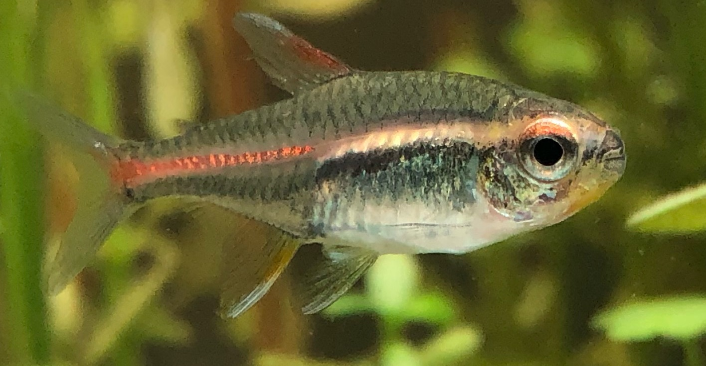
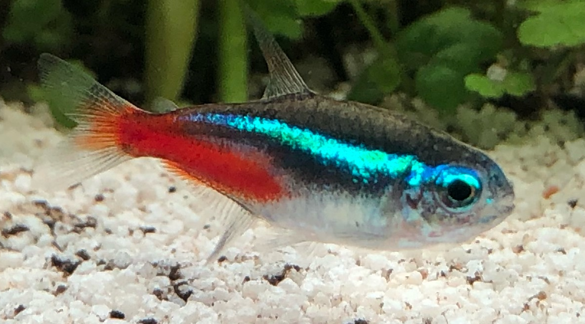
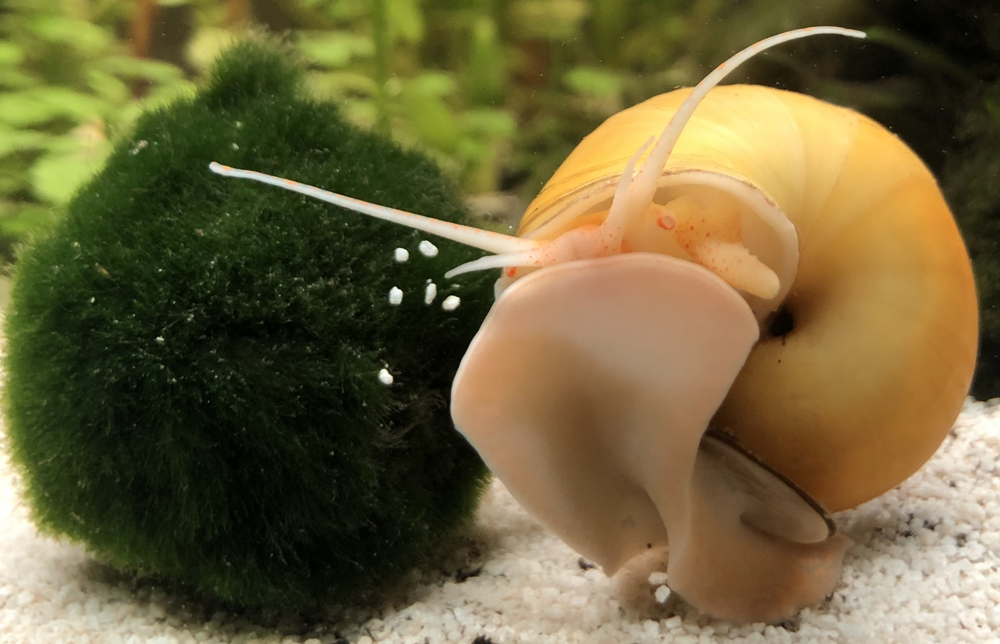

# Tetra Tank

20 gallon community tetra tank in [iwagumi](https://duckduckgo.com/?q=iwagumi&iax=images&ia=images) style and '[Walstad](https://duckduckgo.com/?q=walstad+method&ia=web)' method.  

  
*4 months after set up*

  
*2 months after set up*

  
*2 weeks after set up*

## Fishy

||||
| --- | --- | --- |
|x 9 | Glow light tetra [Hemigrammus erythrozonus](https://en.wikipedia.org/wiki/Hemigrammus_erythrozonus) |  |
|x 11| Neon tetra [Paracheirodon innesi](https://en.wikipedia.org/wiki/Neon_tetra) |  |
|x3 (unplanned refugees) | Black neon tetra [Hyphessobrycon herbertaxelrodi](https://en.wikipedia.org/wiki/Black_neon_tetra) | *I need my photo taken :)* |
|x 6 | Dwarf sucker [Otocinclus](https://en.wikipedia.org/wiki/Otocinclus) |    *A dorsal view of an Oto swaying in the current* |
|x 2 | Apple snails [Ampullariidae](https://en.wikipedia.org/wiki/Ampullariidae) |  (*female*)   (*male*)|

## Diet

**FEEDING TIP**: (Father Fish) *A hungry fish is a healthy fish*. Common metric is eye is about size of stomach; little amount of food, what they can eat in 2-3 minutes (1 minute if few fish). If they don't have a clear appetite during feedings, they are overfed; reduce volume or frequency.

*Breakfast only when young. Stopped after fish were about 2 months after got from pet store*  
7-10 AM PST; Flakes
 
**Dinner**  
6-9 PM PST, 5-6 days/week
* Flakes + bloodworm (freeze dried)  
* Crushed alga wafer for herbivores (infrequent, as supplement for/variety from tank algae)

**Snacks**  
Infrequent
* Crushed shrimp food (omnivore pellet) (mineralization)  
* Blanched zucchini

## Plants

*(Need to retake photos)*

|||
| --- | --- |
| Cyperus helferi (grass-like sedge) |  |
| Hydrocotyle tripartita ('Japan' carpet) |  |
| Bacopa monnieri (water hyssop) |  |
| Blyxa japonica (Japanese rush) |  |
| [Marimo](https://en.wikipedia.org/wiki/Marimo) moss balls (Aegagropila linnaei)|  |
| Seiryu |  |

[List of freshwater aquarium plant species](https://en.wikipedia.org/wiki/List_of_freshwater_aquarium_plant_species)

## Habitat 

### Photonic schehdule

  
*(Fluval AqauSky LED app) As you can see from the schedule, the fish and plants have a clear diurnal schedule*

### Tidal schedule

*TBD*

### Water and substrate

* Temp: 76°F / 24.4°C
* Tap pH (6-8). Water conditioned with cholorine removal only
* No artificial / supplemental filtration beyond coarse and fine mechanical
* Bare bottom water column at tech end (wave maker / heater / filter intake). Makes refilling super easy, also serves as feeding area.
* 1 inch white sand substrate over washed soil. Some rocks in back to create subterranean space in 3 inches of soil. Heavier planting in the back for fish comfort (garden/forest end). Natural algae not removed from here for algaevores / undisturbed habitat.

## Tech

* [Hygger Eco slim wave maker](https://github.com/rsairu/howto/blob/main/hygger_eco_slim.md)
* [Fluval Aquaclear filter](https://github.com/rsairu/howto/blob/main/fluval_aquaclear_powerfilter.md)
* Fluval Aquasky LED
* [Orlushy heater](https://github.com/rsairu/howto/blob/main/orlushy_heater.md)

## Upkeep

Every task here takes about 30-45 minute. So if you do more at once, that would be total service time

|||
| --- | --- |
|Water change |~ one-two times a month, 33% (create a syphon and kick up dust with an eyedropper, pick a small area to work in)  
|Aquascape| Usually done a little with water change, as water is low (trim, cut, remove, plant)
|Service filter/filter media| ~ once a month, as necessary
|Service impeller (of the filter)| ~ 4-5 year, clean impeller  
|Service wave maker|As necessary, to clear error or brush algae

---
*Thanks to fishkeepers: Dana, Hideo, Maria, Amelia, Gigi*  
*Thanks to file contributors: [ProgrammerE](https://github.com/ProgrammerE)*

*RIP first wave of Thanksgiving Fish (x9(?) neon tetra). We love you*  
*We shall not cease from exploration, and the end of all our exploring will be to arrive where we started and know the place for the first time.* -T. S. Eliot  
*If I have seen further than others, it is by standing upon the shoulders of giants.* - Isaac Newton  
*Treat the word impossible as nothing more than motivation*

---
