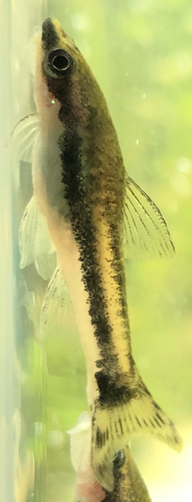
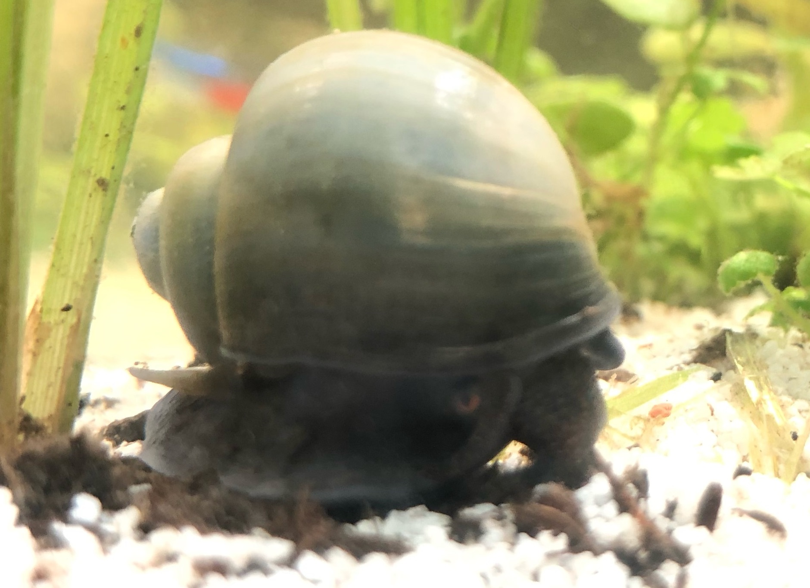

# Tetra Tank

20 gallon community tetra tank in [iwagumi](https://duckduckgo.com/?q=iwagumi&iax=images&ia=images) style. Heavier planting in the back for fish comfort.
1 inch sand substrate, then soil.

**Breakfast** 8-10 AM PST (flakes, algae wafer, or shrimp pellet)  
**Dinner** +~12H after breakfast (freeze dried bloodworm)

## Fishy

||||
| --- | --- | --- |
|x 9 | Glow light tetra [Hemigrammus erythrozonus](https://en.wikipedia.org/wiki/Hemigrammus_erythrozonus) |  |
|x 11 | Neon tetra [Paracheirodon innesi](https://en.wikipedia.org/wiki/Neon_tetra) |  |
|x 2 | Dwarf sucker [Otocinclus](https://en.wikipedia.org/wiki/Otocinclus) |  |
|x 3 | Apple / Mystery snails [Ampullariidae](https://en.wikipedia.org/wiki/Ampullariidae) |        |

## Scape

|||
| --- | --- |
| Cyperus helferi (grass-like sedge) |  |
| Hydrocotyle tripartita ('Japan' carpet) |  |
| Bacopa monnieri (water hyssop) |  |
| Blyxa japonica (Japanese rush) |  |
| [Marimo](https://en.wikipedia.org/wiki/Marimo) moss balls |  |
| Seiryu |  |

(List of freshwater aquarium plant species)[https://en.wikipedia.org/wiki/List_of_freshwater_aquarium_plant_species]

## Tech
* [Hygger Eco slim wave maker](https://github.com/rsairu/howto/blob/main/hygger_eco_slim.md)
* [Fluval Aquaclear filter](https://github.com/rsairu/howto/blob/main/fluval_aquaclear_powerfilter.md)
* Fluval Aquasky LED
* Orlushy heater (76°F / 24.4°C)

*RIP first wave of Thanksgiving Fish (x9(?) neon tetra). We love you*
*We shall not cease from exploration, and the end of all our exploring will be to arrive where we started and know the place for the first time.* -T. S. Eliot
