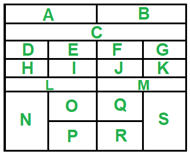

# Layout

A Top left; S Bottom right  
Top row: A B  
Second row: C  (Open shelf counts as "row")  
Third row: D E F G  
...  
Bottom row: N O (up) P (down) Q (up) R (down) S  

# 1 - First row (top)

## A

- Case - Bose Mini Soundlink
- Spare pouches (x2)

## B - Useful

- Screwdriver
- Screwdriver (long tip)
- Measuring tape
- Level (Bubble)
- Box cutter + spare blades
- Scissors
- Snips
- Hammer
- Mag bracelet

# 2 Second row (Open shelf)

## C (Open shelf)

- Computer Monitor Stands x2
- Electric drill
- Torque wrnech
- Oil filter wrench
- Crowbar
- Bar clamp

# 3 Third row

## D - Phone related

- Aquos phone
- Screen protector
  - 6s (Hinako)
  - 8 (Gaku)
  - Big. Useless?
- Old iPad (A1489)
- Airpods Pro (Spare, old Gaku)

## E - USB / Cables

- Thunder to Thunder + AUX
- Thunder to HDMI
- USB C to Thunder x2
- Wireless charging station
- USB 1-to-2 splitter
- USB bluetooth
- USB Logitech receiver

## F

- Precision screwdriver set
- Precision set ("jewelry" type)
- Antenna adapters

## G

- Staple gun + staples

# 4 - Fourth row

## H

- Hooks

## I

- Socket extender
- Socket angle converter
- Socket size converter
- Bolt breaker
- Impact bit set

## J - Ojiichama's tools

- Pipe wrench
- Adjustable wrench
- Ultra long flat head
- Fine pliers, tweezers
- Rasp
- Chisel x3
- Chisel (Nail of the Cross)

## K

- Drill bit set

# 5 - Fifth row (double wides)

## L

## M - Networking cables

- Coaxial cables (x1 XS, x2 M, x2 right angle M)
- Ethernet cables (x3 S, x1 M, x2 L)
- Coax splitter, male-to-male (extender) connector
- RJ45 (x1 M)
- Antenna adaptors

# Bottom row

## N (bottom left)

- Heat gun
- Sander
- Extension cables (x2 M)

## O (up) - Sewing

- Sewing kits, buttons
- Fabric scissors
- Little house bed comforter patch kit

## P (down) - Computer

- Computer fans
- Intel NUC (thin) + power cable
  - USB cooling fan mounting hardware
- Mechanical keyboard spares + puller
- Kinetic speaker
- Cable wraps

## Q (up)

- Paint tip

## R (down)

- Scotch tape
- Level (Laser)

## S (Bottom right) - PPE

- PPE
  - Mask
  - Goggles
  - Ear muffs
